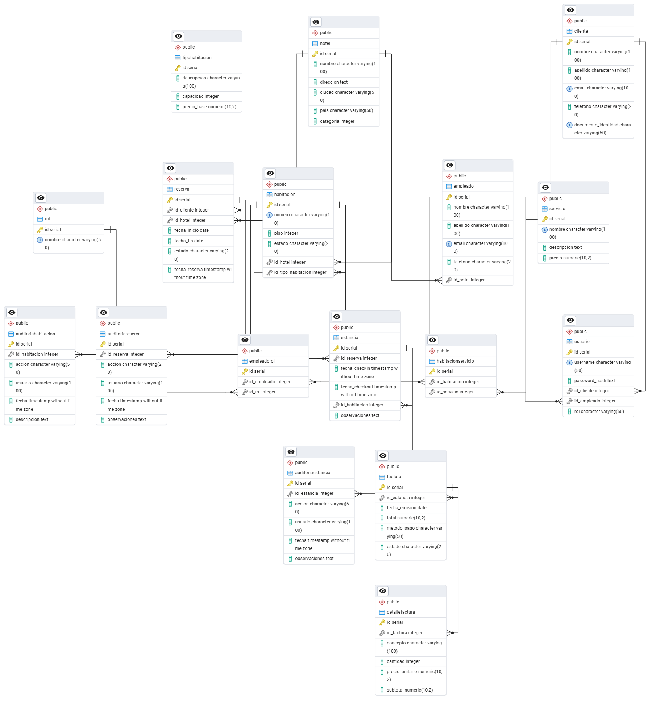

## Proyecto Base de Datos

### Descripción
El sistema está diseñado para gestionar múltiples hoteles dentro de una cadena, incluyendo habitaciones, clientes, reservas, estancias, servicios adicionales (como spa y restaurante), facturación, empleados, roles y más. Se organiza en 17 tablas que cubren todos los aspectos de la gestión hotelera, permitiendo una administración eficiente de recursos y una experiencia de usuario fluida.

---
## Archivos y Contenido

***Carpeta Base_Datos***
### Base_Datos.txt
- Este Archivo Contiene el srcip para la creacion de la Base de Datos (Incluye 17 Tablas) 
    - Hotel: Información general del hotel.
    - Habitacion: Detalles de cada habitación.
    - TipoHabitacion: Define el tipo, capacidad y tarifa base de las habitaciones.
    - Cliente: Datos de los huéspedes.
    - Reserva: Control de reservas realizadas por los clientes.
    - Estancia: Registra la ocupación efectiva de una habitación.
    - AuditoriaReserva, AuditoriaEstancia, AuditoriaHabitacion: Registro automático de cambios críticos (triggers).
    - Factura y DetalleFactura: Registro de pagos y consumos.
    - Servicio: Servicios adicionales disponibles en el hotel.
    - HabitacionServicio: Relación muchos a muchos entre habitaciones y servicios.
    - Empleado, Rol, EmpleadoRol: Gestión de empleados y sus roles.
    - Usuario: Usuarios del sistema (clientes y empleados) con control de acceso.
    

### Complementos.txt
- Este Documento Contiene lo que es el apartado de las adiciones realizadas en la base de datos:
    - Triggers
    - SP (Storaged Procedure)
    - Views
    - Indices
    - Funciones
    - Consultas
    - Consutas Complejas (Ctes)
    - Subconsultas
    - Roles y Seguridad

### Inserciones.txt
- Este Documento incluye 7 Inserciones para cada Tabla, a excepcion de las de Auditoria. 

### Codigo_Uso.txt
- Este Documento abarca un codigo de uso para probar cada complemento, excluyendo lo que son los indices, ya que siendo honesto la misma base de datos elije el momento en el cual utilizarlos

---
***Carpeta Modelo_Relacional***
### ModeloRelacional.png
Es el modelo Relacional extraido de PgAdmin4 

**Vista Previa**

---
***Carpeta Backup***
### Proyecto.

- Es el Backup de la base de datos, con todos los complememtos ya instalados (Se encuuentra en la carpeta Backup) 

---
### DiccionarioDeDatos.xlsx

- Es un documento o herramienta que describe detalladamente los elementos de datos utilizados en un sistema de información, como una base de datos o aplicación. Su propósito principal es documentar y estandarizar la información para facilitar la comprensión, el mantenimiento y la integración del sistema.

### Presentacion_Proyecto.pptx

- La presentacion utilizada durante la Sustentacion del PROYECTO, abarca informacion substancial y de manera clara abarca el contenido en 14 Slides, que van desde el contexto, hasta las conclusiones.
